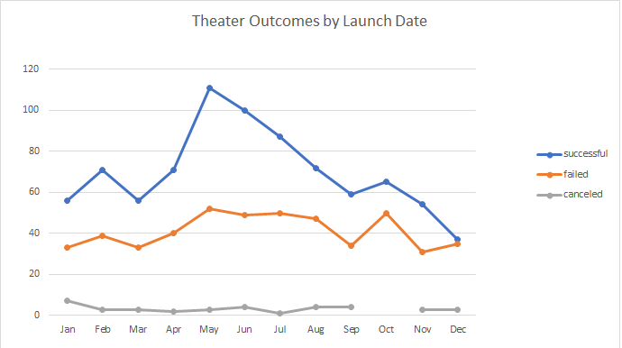
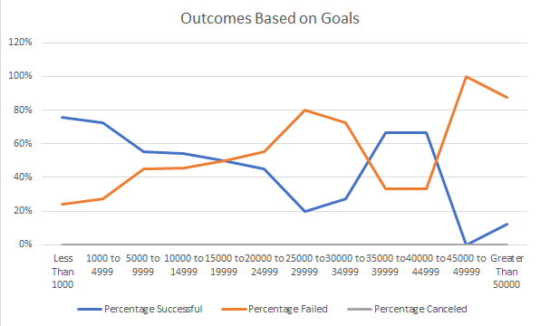

# An Analysis of Kickstarter Campaigns

## Overview of Project
    Performing data analysis on the crowdfunding projects to uncover any hidden trends

---
### Purpose
    Use the dataset to analyze what criteria drives towards a successful campaign

## Analysis and Challenges

    1. Clean up the data to make it easy to read. This includs conversion of the time stamps, separate the category and subcategory, calculating the average.  

    2. Determine what kind of anaylis we can perform based on the dataset. i.e. outcomes based on launch date; outcome based on goal amount; outcomes based on category, or country; percentage funcded based on category, or country, or goal amount, etc.

    3. Didn't encounter any challenge during the analysis. when I created the formulas to calculated the countifs for the outcome by goals, I used the $ to make the columns static for easy copying and paste to apply the whole table. 

### Analysis of Outcomes Based on Launch Date

### Analysis of Outcomes Based on Goals

### Challenges and Difficulties Encountered

## Results

- What are two conclusions you can draw about the Outcomes based on Launch Date?

    In this analysis, I created the pivot table based on the number of outcomes for the subcategory "Theater".

    Based on the analysis, we can see that the number of successful campaigns in the subcategory theater are much higher for those that launched in May and June over the years and lower number of failed. And the campaigns launched in December has a higher chance to fail than succeed.  Based on this analysis, it would recoomand to launch a new campaign during the month of May/June to have a higher expectation of success. On the other hand, it is not recommand to run the compaign in December as the outcomes for success is very low.

- What can you conclude about the Outcomes based on Goals?

    The campaigns has a higher successful percentage with lower goals and the lower failed percentage. When the goals increase, the percentage of success dropped and percentage of failed rise. 

- What are some limitations of this dataset?

    In the outcomes based on Goals, the success percentage increase for the goal range from 3500-45000. But the dataset does not provide other details that we can perform further analysis what's the cause of this exception in this goal range. 

- What are some other possible tables and/or graphs that we could create?

    In both the outcomes based on launch date and outcome base on goals, we can use add the filters of country or year to further analysis based locaiton, or time. 

    For those successful campaigns, we can use the range of Percentage funded to evalute how successful for different categories. 

    Additionally, for the campaign, we can use the box and whisker to identify and address the outliers. For example, in the outcome based on goals analysis, the successful percentage for the range of 35000-45000 could be a potential outlier. 

    
